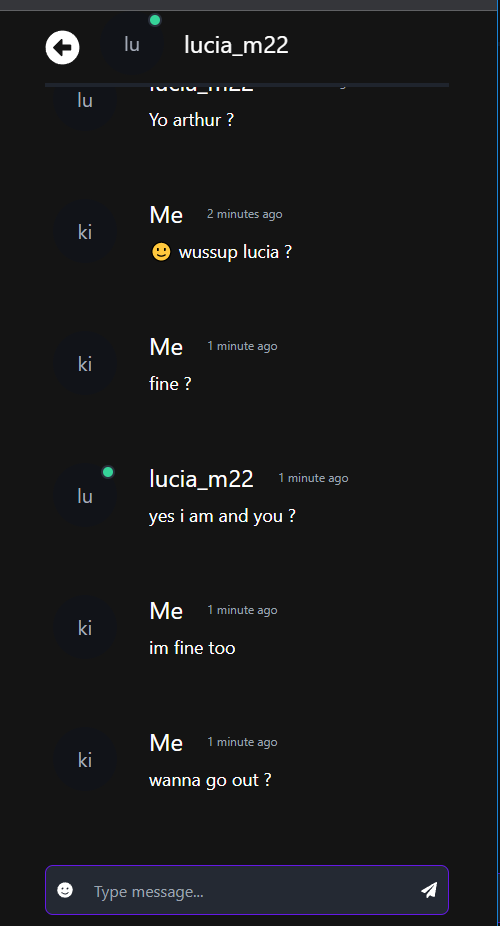

# chat.io is a private chat app
## Techs used
1. MERN stack
2. Redux/Reduxtoolkit for state management
3. Tailwindcss + Daisyui
4. socket-io for implementing websockets

## Features
* private chatting
  
  
  
* block friends
  
  
* find new friends and send friend requests
  
  
    


## Prerequesites
* Node js
* MongoDB

## How to run

### install the dependencies
```bash
    npm install
```

```bash
    cd client && npm install
```

### copy .env.example and modify .env (add your values)
```bash
    cp .env.example .env
```
```
MONGO_URI = 
JWT_ACCESS_SECRET_KEY = 
JWT_REFRESH_SECRET_KEY = 
```
### start the project
```bash
    cd .. && npm run dev
```

### enter [http://localhost:3000](http://localhost:3000)


## TODO (next tasks) 
- [ ] add profile customization
- [ ] improve database queries and implement rate limiting in api
- [ ] Add group chat
- [ ] Try implement audio and video chatting using Webrtc
 


